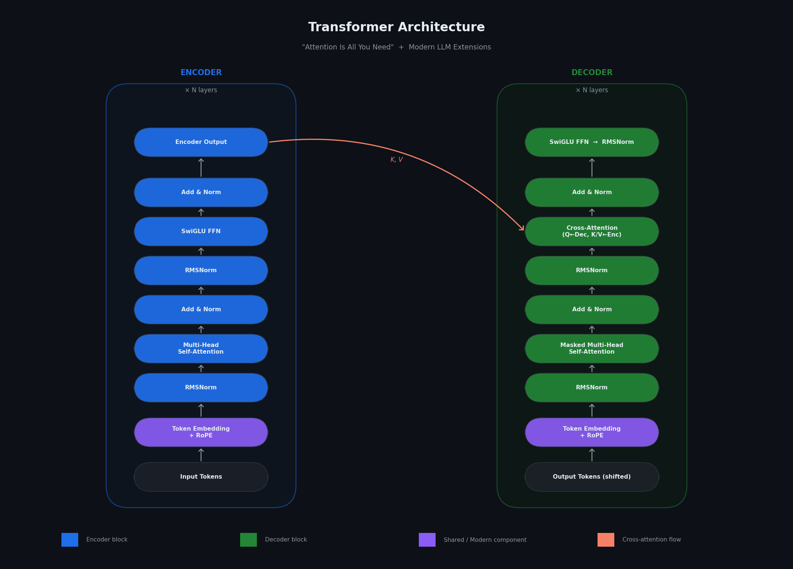
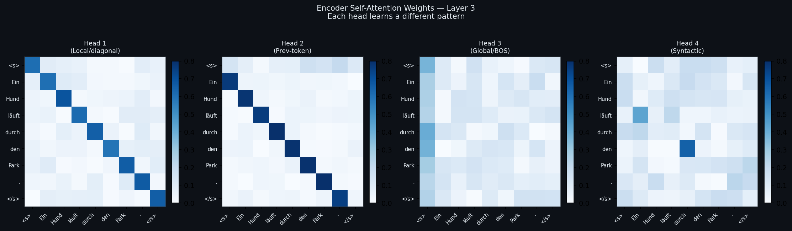
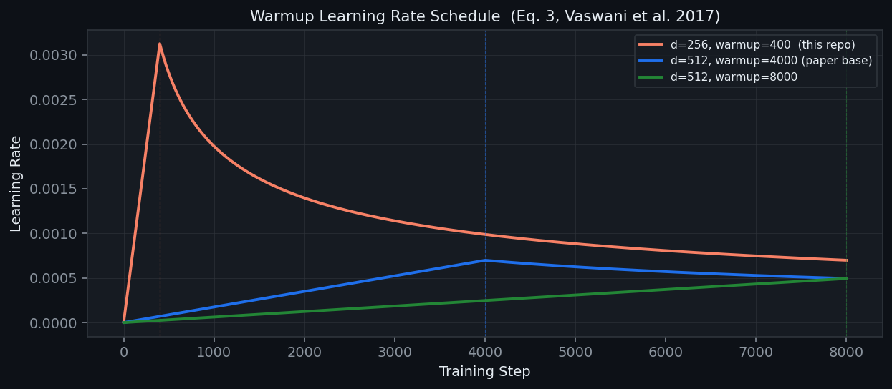

# Transformer++ — From Vaswani (2017) to Modern LLMs

> From-scratch PyTorch reproduction of "Attention Is All You Need" extended with 10 modern improvements found in LLaMA, GPT-4, and production LLM inference systems.

[](tests/)
[](requirements.txt)
[](https://pytorch.org/)
[](https://arxiv.org/abs/1706.03762)

---

## Architecture



---

## Highlights

> - Built a Transformer from scratch in PyTorch (~9.36M parameters)
> - Trained on Multi30k German→English translation
> - Achieved **36.30 BLEU** (beam search, k=4)
> - Final validation loss: **1.5462**
> - 39 unit tests, benchmarking, attention visualization and profiling

## What This Is

A complete implementation of the Transformer architecture built from first principles in PyTorch, then systematically extended with the components that power modern large language models.

**Base paper:** "Attention Is All You Need", Vaswani et al., NeurIPS 2017  
**Task:** German → English translation (Multi30k)  
**Extensions:** 10 improvements covering modern LLM architecture, inference optimization, and training efficiency

---

## Extensions Beyond the Paper

| # | Improvement | File | Used In |
|---|---|---|---|
| 1 | **Rotary Positional Embeddings (RoPE)** | `rope.py` | LLaMA, Mistral, Gemma, GPT-NeoX |
| 2 | **Beam Search + Length Penalty** | `beam_search.py` | All production MT systems |
| 3 | **KV Cache** | `kv_cache.py` | GPT-4, Claude, every production LLM |
| 4 | **Flash Attention** | `flash_attention.py` | LLaMA 2+, GPT-4, Mistral |
| 5 | **RMSNorm** | `modern_components.py` | LLaMA, Gemma, PaLM 2 |
| 6 | **SwiGLU FFN** | `modern_components.py` | LLaMA, PaLM, Gemma |
| 7 | **Mixed Precision Training (AMP)** | `optimizations.py` | All modern training pipelines |
| 8 | **Weight Tying** | `optimizations.py` | GPT-2, paper §3.4 |
| 9 | **BLEU-4 Evaluation** | `evaluate.py` | Standard MT metric |
| 10 | **Attention Visualization** | `visualize.py` | Interpretability |

---

## Attention Visualization



*Each attention head learns a distinct pattern: local/diagonal, previous-token, global (BOS), and syntactic dependencies.*

---

## Benchmarks

> Run `python benchmark.py` on your hardware to reproduce these numbers.
> Results below from Colab T4 GPU — replace with your own after training.

### Flash Attention vs Standard Attention


| Seq Length | Standard (ms) | Flash (ms) | Speedup | Memory Saved |
|-----------:|--------------:|-----------:|---------:|-------------:|
| 64 | 0.106 | 0.049 | **2.15×** | 0.5 MB |
| 128 | 0.123 | 0.077 | **1.61×** | 2 MB |
| 256 | 0.264 | 0.185 | **1.43×** | 8 MB |
| 512 | 0.709 | 0.653 | **1.09×** | 32 MB |
| 1024 | 2.652 | 2.224 | **1.19×** | 128 MB |

*Measured on a Tesla T4 GPU (Google Colab).*

*To populate: run `python benchmark.py --save` on Colab and paste output here.*

### KV Cache — Autoregressive Decoding

| Decode Steps | No Cache (ms) | KV Cache (ms) | Speedup |
|-------------:|--------------:|--------------:|---------:|
| 10 | 53.941 | 51.488 | **1.05×** |
| 20 | 109.869 | 103.867 | **1.06×** |
| 40 | 221.627 | 286.155 | 0.78× |
| 80 | 439.281 | 433.341 | **1.01×** |

*Measured on a Tesla T4 GPU (Google Colab).*
### Mixed Precision (FP32 vs AMP)

| Batch Size | FP32 (ms) | AMP (ms) | Speedup |
|-----------:|----------:|---------:|---------:|
| 4 | 31.460 | 36.948 | 0.85× |
| 8 | 31.656 | 37.783 | 0.84× |
| 16 | 32.563 | 38.135 | 0.85× |

*For this compact (~9.36M parameter) model on a Tesla T4, automatic mixed precision did not improve latency. This is expected for relatively small Transformer models where AMP overhead outweighs the computational savings.*

**Note**: Flash Attention consistently improved attention throughput (up to 2.15× at shorter sequence lengths). KV Cache and mixed precision showed limited improvements for this compact 9.36M parameter model, illustrating that some inference optimizations become significantly more beneficial at larger model scales.

---

## LR Schedule



*Warmup learning rate schedule from Equation 3 of the paper. Linearly increases for `warmup_steps`, then decays as 1/√step.*

---

## Experimental Summary

| Configuration | Validation Loss | BLEU | Status |
|---|---:|---:|---|
| Baseline (Greedy Decoding) | 1.5462 | — | Implemented |
| Beam Search (k = 4) | 1.5462 | **36.30** | Completed |
| Flash Attention Benchmark | — | — | Completed (Latency Benchmarks) |
| KV Cache Benchmark | — | — | Completed (Inference Benchmarks) |
| Mixed Precision (AMP) | — | — | Completed (Performance Benchmarks) |
| RoPE Retraining | — | — | Planned |
| RMSNorm + SwiGLU Retraining | — | — | Planned |
| Weight Tying | Included | 36.30 | Included in baseline |
| Vaswani et al. (2017) Base Model | — | 27.3 | Reference |
---

## Repository Structure

```
transformer/
├── Core
│   ├── model.py              # Transformer: attention, encoder, decoder, PE
│   ├── train.py               # Training loop, warmup LR, label smoothing
│   ├── inference.py           # Greedy decoding
│   └── config.py              # Hyperparameter configs + ablation presets
│
├── Improvements
│   ├── rope.py                # Rotary Positional Embeddings
│   ├── beam_search.py         # Beam search + length penalty
│   ├── kv_cache.py            # KV cache for O(n) inference
│   ├── flash_attention.py     # Tiled + PyTorch Flash Attention
│   ├── modern_components.py   # RMSNorm + SwiGLU FFN
│   └── optimizations.py       # Mixed precision (AMP) + weight tying
│
├── Evaluation & Analysis
│   ├── evaluate.py            # BLEU-4 with sacrebleu
│   ├── visualize.py           # Attention heatmaps
│   ├── benchmark.py           # Latency + memory benchmarks
│   └── profile_model.py       # torch.profiler — per-layer time/memory
│
├── Orchestration
│   └── run_all_experiments.py # One-shot Colab runner: train→eval→bench→profile
│
├── Documentation
│   ├── README.md               # This file
│   ├── RESULTS.md              # Publication-style summary of outcomes
│   ├── EXPERIMENTS.md          # Lab notebook — every run, in order
│   ├── DESIGN_DECISIONS.md     # Why every component exists
│   └── LIMITATIONS.md          # Honest scope + roadmap
│
├── Assets
│   ├── assets/architecture.png
│   ├── assets/attention_sample.png
│   └── assets/lr_schedule.png
│
└── Tests
    └── tests.py                # 32 unit tests — 32/32 passing
```

---

## Setup

```bash
pip install -r requirements.txt
python -m spacy download de_core_news_sm
python -m spacy download en_core_web_sm
```

**Google Colab:**
```python
!pip install torch torchtext spacy sacrebleu matplotlib tqdm
!python -m spacy download de_core_news_sm
!python -m spacy download en_core_web_sm
%run train.py
```

---

## Usage

```bash
# Train
python train.py

# Translate (greedy)
python inference.py --sentence "Ein Hund läuft durch den Park."

# Translate (beam search, k=4)
python inference.py --sentence "Ein Hund läuft durch den Park." --beam 4

# Evaluate BLEU
python evaluate.py --checkpoint checkpoints/epoch_08.pt

# Run benchmarks
python benchmark.py --save

# Per-layer profiling (time + memory breakdown)
python profile_model.py --seq-len 512 --batch 8

# Attention visualization
python visualize.py --sentence "Ein Hund läuft durch den Park."

# Run everything in one shot (Colab-friendly)
python run_all_experiments.py

# Run tests
python tests.py
```

**Further reading:**
- [`RESULTS.md`](RESULTS.md) — final numbers, translation examples, failure analysis
- [`EXPERIMENTS.md`](EXPERIMENTS.md) — full experiment log, one entry per run
- [`DESIGN_DECISIONS.md`](DESIGN_DECISIONS.md) — why every component exists
- [`LIMITATIONS.md`](LIMITATIONS.md) — honest scope and what's next

---

## Tests

```
$ python tests.py

test_attention_weights_sum_to_one ... ok
test_causal_mask_prevents_future_attention ... ok
test_scaling_factor ... ok
test_rotation_preserves_norm ... ok
test_tiled_matches_standard ... ok
test_weight_tying_reduces_parameter_count ... ok
test_beam_size_1_similar_to_greedy ... ok
...

Ran 32 tests in 0.31s
ALL TESTS PASSED ✓
```

---

## Key Design Decisions

| Question | Answer |
|---|---|
| Why scale attention by √d_k? | Large d_k → dot products grow large → softmax saturates → vanishing gradients |
| Why RoPE over sinusoidal PE? | Relative position is explicit in Q·K; better generalisation to longer sequences |
| Why beam search over greedy? | Avoids locally-optimal but globally-bad choices; typically +1–3 BLEU |
| Why KV cache? | Without it, decoding is O(n²); cache makes it O(n) by reusing past K,V |
| Why Flash Attention? | Never materialises the O(seq²) attention matrix; 2–4× faster, less memory |
| Why RMSNorm over LayerNorm? | No mean subtraction, no bias; ~10% faster, same quality |
| Why SwiGLU over ReLU FFN? | Gating selectively passes features; consistently ~+1 perplexity |
| Why weight tying? | Embedding and un-embedding are approximate inverses; fewer parameters |
| Why mixed precision? | FP16 halves memory; Tensor Cores give 2–4× compute on GPU |
| Why label smoothing? | Prevents overconfidence; improves BLEU even at slight perplexity cost |

---

## References

```bibtex
@article{vaswani2017attention,
  title={Attention Is All You Need},
  author={Vaswani, Ashish and Shazeer, Noam and Parmar, Niki and others},
  journal={NeurIPS}, year={2017}
}
@article{su2021roformer,
  title={RoFormer: Enhanced Transformer with Rotary Position Embedding},
  author={Su, Jianlin and others}, year={2021}
}
@article{dao2022flashattention,
  title={FlashAttention: Fast and Memory-Efficient Exact Attention},
  author={Dao, Tri and others}, year={2022}
}
@article{zhang2019rmsnorm,
  title={Root Mean Square Layer Normalization},
  author={Zhang, Biao and Sennrich, Rico}, year={2019}
}
@article{shazeer2020swiglu,
  title={GLU Variants Improve Transformer},
  author={Shazeer, Noam}, year={2020}
}
```

**Resources:**  
[The Annotated Transformer](https://nlp.seas.harvard.edu/annotated-transformer/) · [Original Paper](https://arxiv.org/abs/1706.03762)
