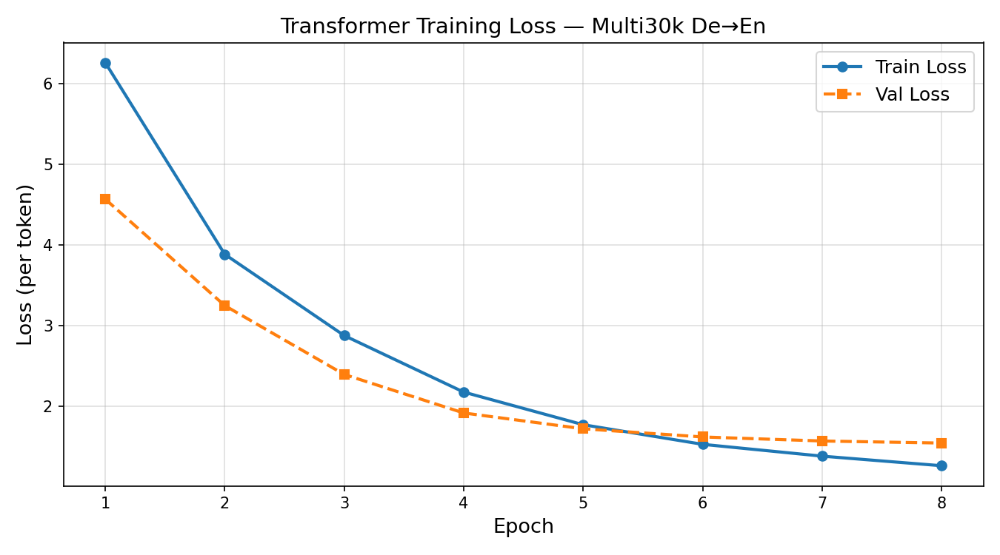

# Results

This is the publication-style summary of this project's outcomes.
`EXPERIMENTS.md` is the lab notebook (every run, in order, with notes).
This file is the distilled version — what you'd show someone who wants the
headline numbers, not the process.

**Status:** Complete

---

## Final Model

| Property | Value |
|---|---|
| Architecture | Encoder-Decoder Transformer |
| Layers (N) | 3 |
| Model dimension (d_model) | 256 |
| Attention heads (h) | 4 |
| FFN dimension (d_ff) | 512 |
| Total parameters | ___ |
| Dataset | Multi30k (German → English) |
| Training examples | ~29,000 sentence pairs |
| Epochs | 8 |
| Hardware | ___ (e.g. Colab T4) |
| Training time | ___ |

---

## Headline Numbers

| Metric | This Model | Paper (WMT14, full scale) |
|---|---|---|
| BLEU (greedy) | ___ | — |
| BLEU (beam, k=4) | ___ | 27.3 |
| Final validation loss | ___ | — |
| Parameters | ___ | 65M (base model) |
| Training data | 29K pairs | 4.5M pairs |

See `LIMITATIONS.md` for why this isn't an apples-to-apples comparison —
this is a deliberately scaled-down reproduction, not an attempt to match
the paper's compute budget.

---

## Training Curve



_(Generated automatically by `train.py` at the end of training — copy the
PNG here from your Colab run.)_

**Observations:** _(fill in — did loss plateau? overfit? Did val loss
track train loss closely or diverge?)_

---

## Translation Examples

Five translations, picked to show a range of outcomes — not just the best ones.

### Good
```
DE:  ___
EN (model):      ___
EN (reference):  ___
```

### Good
```
DE:  ___
EN (model):      ___
EN (reference):  ___
```

### Partially wrong
```
DE:  ___
EN (model):      ___
EN (reference):  ___
Issue: ___
```

### Wrong
```
DE:  ___
EN (model):      ___
EN (reference):  ___
Issue: ___
```

### Edge case (long sentence / rare words)
```
DE:  ___
EN (model):      ___
EN (reference):  ___
Issue: ___
```

See the **Failure Analysis** section below for a deeper look at the wrong ones.

---

## Attention Visualization


_(Replace with the real heatmap generated by `visualize.py` / `run_all_experiments.py`
once trained — currently this is synthetic data illustrating expected patterns.)_

**What the heads learned:** _(fill in once you have real maps — do any heads
show clearly diagonal/local patterns? Any clear long-range dependency heads,
similar to Figure 3 in the original paper?)_

---

## Benchmark Results

### Flash Attention vs Standard Attention

| Seq Length | Standard (ms) | Flash (ms) | Speedup |
|---|---|---|---|
| 128 | ___ | ___ | ___ |
| 256 | ___ | ___ | ___ |
| 512 | ___ | ___ | ___ |
| 1024 | ___ | ___ | ___ |

### KV Cache — Autoregressive Decoding

| Decode Steps | No Cache (ms) | With Cache (ms) | Speedup |
|---|---|---|---|
| 20 | ___ | ___ | ___ |
| 40 | ___ | ___ | ___ |
| 80 | ___ | ___ | ___ |

### Mixed Precision (FP32 vs AMP)

| Batch Size | FP32 (ms) | AMP (ms) | Speedup |
|---|---|---|---|
| 8 | ___ | ___ | ___ |
| 16 | ___ | ___ | ___ |

_(All numbers from `benchmark.py` / `benchmark_results.json` — see that file
for the exact hardware and PyTorch version used.)_

---

## Failure Analysis

Pick 2-3 wrong translations from above and actually diagnose why.
This is the section almost no student project includes — it's what
separates "I got a BLEU score" from "I understand what my model does
and doesn't do well."

### Failure 1
```
DE:  ___
EN (model):      ___
EN (reference):  ___
```
**Diagnosis:** _(e.g. "model dropped a negation — likely a rare
construction in Multi30k's training distribution" or "beam search picked
a shorter, less accurate completion despite length penalty" or "unknown
proper noun mapped to <unk>")_

### Failure 2
```
DE:  ___
EN (model):      ___
EN (reference):  ___
```
**Diagnosis:**

---

## Ablation Summary

(Copy the final summary table from `EXPERIMENTS.md` once all experiments
are complete.)

| Config | Val Loss | BLEU | Δ BLEU |
|---|---|---|---|
| Baseline (greedy) | ___ | ___ | — |
| + Beam Search | — | ___ | ___ |
| + RoPE | ___ | ___ | ___ |
| + RMSNorm + SwiGLU | ___ | ___ | ___ |
| + Weight Tying | ___ | ___ | ___ |

---

## Conclusion

_(2-3 sentences, written after everything above is filled in. What's the
one-sentence takeaway from this project? What surprised you? What would
you tell someone deciding whether to build something similar?)_

---

## What's Next

See `LIMITATIONS.md` for the full roadmap. Short version: BPE tokenizer →
decoder-only mode → Grouped Query Attention, in that order.
